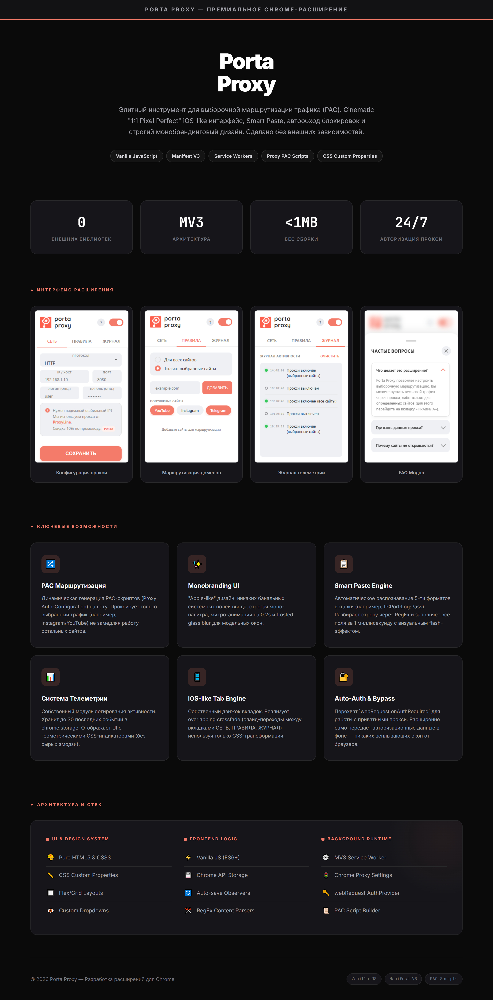

# 🔒 Porta Proxy

**Premium Chrome Extension for Selective Traffic Routing**


> Elegant proxy management tool with iOS-inspired UI, PAC script generation, smart paste engine, and network telemetry — built with zero external dependencies.

---


## 🎨 Project Presentation




## ✨ Key Features

### 🔀 PAC Script Routing
Dynamic generation of Proxy Auto-Configuration scripts on the fly. Routes only selected traffic (e.g., Instagram, YouTube) through the proxy — everything else stays direct for zero performance impact.

### 🎨 Monobranding iOS-like UI
Apple-inspired design system: no default browser inputs, strict mono-palette, 0.2s micro-animations, and frosted glass blur for modals. All built with pure CSS Custom Properties.

### 📋 Smart Paste Engine
Automatic recognition of 5+ proxy string formats (e.g., `IP:Port:Login:Password`). Parses input via RegEx and fills all fields in under 1ms with a visual flash effect.

### 📊 Telemetry System
Custom activity logging module. Stores up to 30 recent events in `chrome.storage`. Displays data with geometric CSS indicators — no raw text, just clean UI.

### 📱 iOS-like Tab Engine
Custom tab navigation engine with overlapping crossfade transitions between NETWORK, RULES, and LOG tabs using only CSS transforms.

### 🔐 Auto-Auth & Bypass
Intercepts `webRequest.onAuthRequired` for private proxy authentication. Credentials are passed silently in the background — no browser popups.

---

## 🏗️ Architecture

```
┌─────────────────────────────────────────────────┐
│                  UI & Design System              │
│  Pure HTML5/CSS3 · CSS Custom Props · Flex/Grid  │
│  Custom Dropdowns · Frosted Glass Modals         │
├─────────────────────────────────────────────────┤
│                 Frontend Logic                   │
│  Vanilla JS (ES6+) · Chrome Storage API          │
│  Auto-save Observers · RegEx Content Parsers     │
├─────────────────────────────────────────────────┤
│               Background Runtime                 │
│  MV3 Service Worker · Chrome Proxy Settings API  │
│  webRequest AuthProvider · PAC Script Builder    │
└─────────────────────────────────────────────────┘
```

---

## 🛠️ Tech Stack

| Layer | Technology |
|---|---|
| **Language** | Vanilla JavaScript (ES6+) |
| **Extension API** | Chrome Extensions Manifest V3 |
| **Proxy Engine** | PAC Scripts + `chrome.proxy` |
| **Auth** | `webRequest.onAuthRequired` |
| **Storage** | `chrome.storage.local` |
| **Styling** | Pure CSS3, Custom Properties, Flexbox/Grid |
| **Dependencies** | **0** (zero external libraries) |

---

## 🔒 Source Code

> **Note:** This repository serves as a portfolio showcase. The full source code is closed/commercial, but the architecture and implementation details can be reviewed upon request during technical interviews.
---

## 📄 License

MIT © 2026 [gajsin](https://github.com/gajsin)
